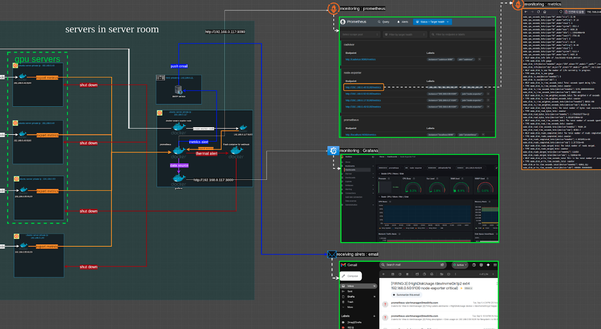
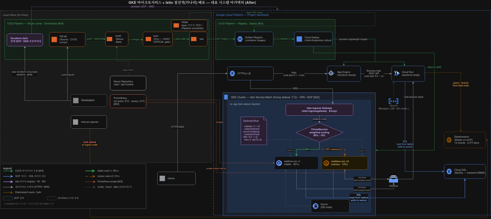
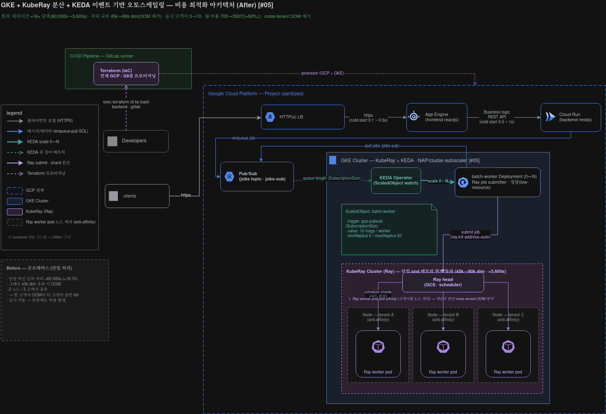

# Architecture

대표 시스템 다이어그램 및 관제 화면 모음입니다.

---

## Prometheus 로 GPU Server 관제 체계 확립

> GPU 서버 메트릭(온도·사용률·메모리 등)을 Prometheus 로 수집하고, 임계치 초과 시 Alertmanager 로 알람을 발생시켜 무인 관제 체계를 확립했습니다. — 관련 사례: [#03 Observability & Auto-remediation](../case-studies/03-observability-autoremediation.md)

---

## Kubernetes · Service Mesh 로 배포 안정화 및 카나리 업데이트 체계 확립

> WebSocket 모놀리스를 GKE 마이크로서비스로 분해하고, Istio 서비스 메시로 트래픽 분할·카나리 배포를 구현해 무중단 점진적 배포 체계를 확립했습니다. — 관련 사례: [#02 Monolith → Microservices (GKE + Istio)](../case-studies/02-monolith-to-microservices-gke-istio.md)

---

## Kubernetes(GKE) · KEDA · KubeRay 를 통한 메인 분석 서비스의 Workload 안정화 및 확장 — 고객사 사용량·고객사 수 증대 기여 아키텍처

> 메인 분석 서비스를 GKE 위에서 KubeRay 로 분산 처리하고 KEDA 로 큐 기반 0↔N 오토스케일링을 적용해, 워크로드를 안정화·확장하고 고객사 사용량 증대와 동시 수용 고객사 수 증대(3→10)에 기여했습니다. — 관련 사례: [#05 Cloud Migration & Cost Optimization](../case-studies/05-cloud-migration-cost-optimization.md)
