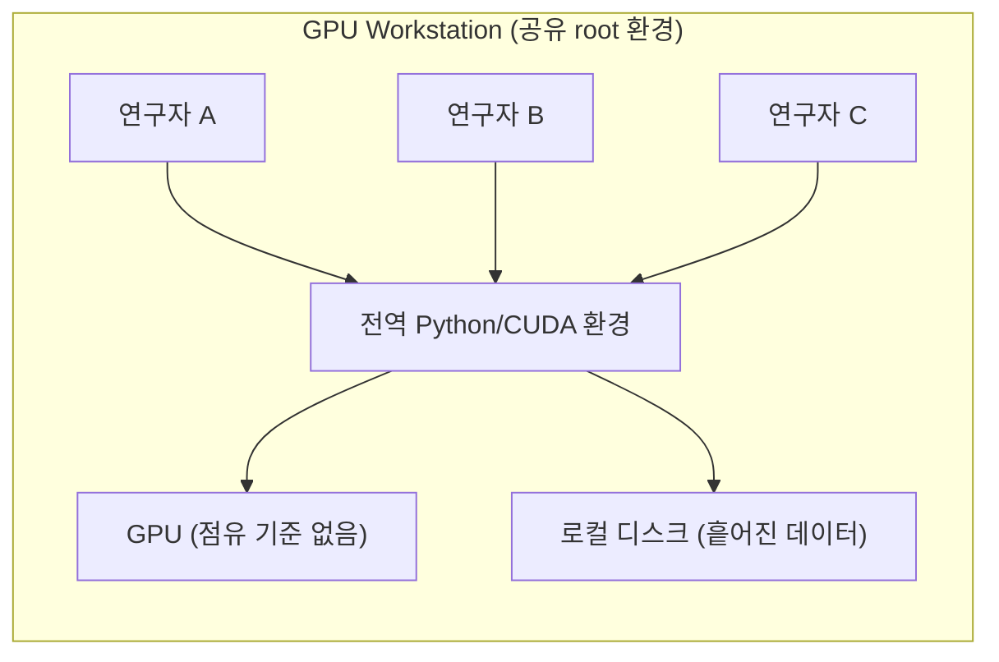
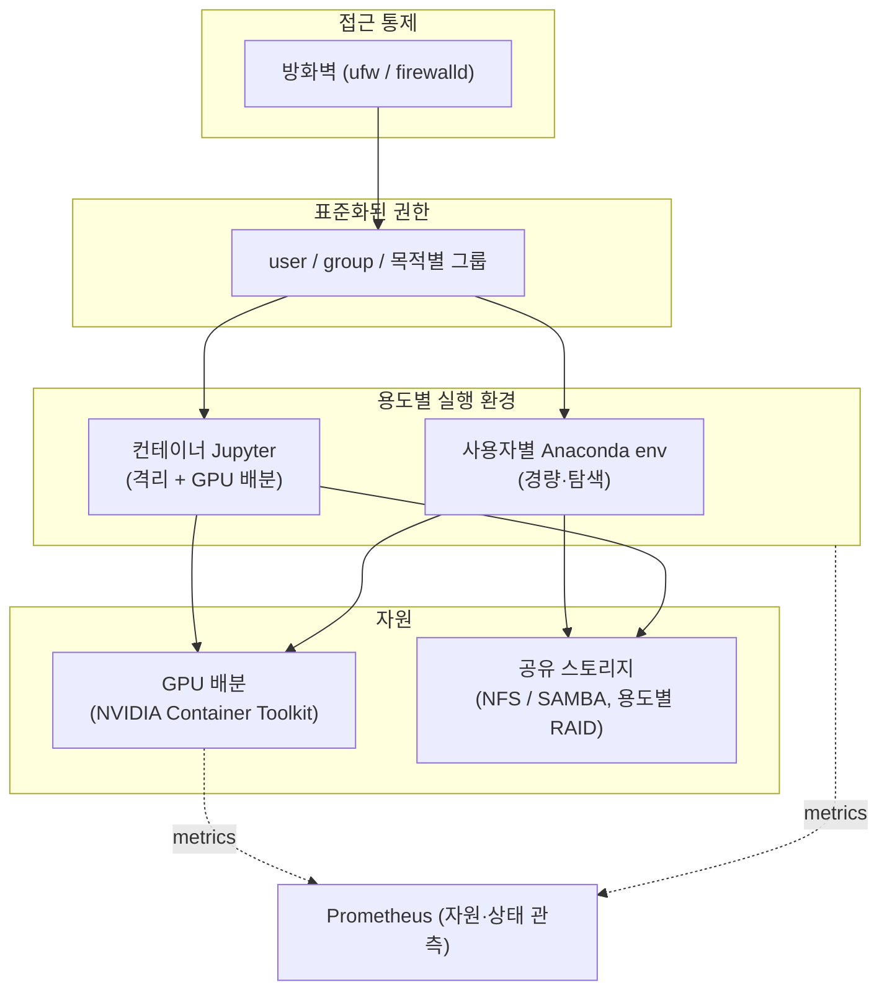

<!-- Sanitized — 고객사명·시크릿·내부 식별자 제거. 일반화한 부분은 "(일반화함)"으로 표기. 미확정 수치는 TODO. -->

# 연구용 GPU 플랫폼 멀티테넌시 구축 — 공유 GPU 워크스테이션을 "셀프서비스 연구 플랫폼"으로

> **TL;DR**: 여러 연구자가 제각기 쓰던 GPU 워크스테이션을, 사용자·그룹·권한을 표준화하고 용도별 환경(anaconda / 컨테이너 Jupyter)과 GPU 배분·공유 스토리지를 갖춘 **멀티테넌트 연구 플랫폼**으로 재구성했습니다.

| | |
|---|---|
| **역할 (Role)** | GPU 플랫폼 설계·구축·운영 담당 (관리자) |
| **기간·규모 (Scope)** | TODO: <운영 기간 / GPU 노드 수 / 연구자 수> |
| **스택 (Stack)** | Linux, NVIDIA GPU/driver, Docker(+NVIDIA Container Toolkit), Anaconda, JupyterHub/Notebook, NFS·SAMBA, RAID, ufw/firewalld, Prometheus |
| **핵심 결과 (Impact)** | 연구자별 환경 격리 + GPU 공정 배분 + 표준화된 권한 체계로 "각자 알아서 쓰던" 워크스테이션을 운영 가능한 공용 플랫폼화 |

---

## 1. 문제 또는 맞이했던 상태

연구 조직에서 고가의 GPU 워크스테이션을 여러 연구자들이 공유해야 했지만, 초기에는 사실상 **root 환경 공유에 가까운 상태**였습니다.

- 연구자마다 전역 환경에 직접 패키지를 설치 → 의존성 충돌 (keras tensorflow 의존성 충돌)
- GPU를 누가 얼마나 점유하는지 **배분 기준이 없었음** → 한 사람의 작업이 전체를 rtx6000 8장 점유한 상태에서 tensorflow session 시작하는 초기 문제
- 권한이 표준화되어 있지 않아 **접근 통제**를 모두 수작업으로 진행했었음
- 연구 데이터가 로컬 디스크에 흩어져 **공유·백업·재현이 어려움**

on-prem 서버의 spec은 강력했지만 **"플랫폼"이 아니라 "공용 PC"**. 목표는 연구자들이 서로 간섭 없이 밀폐된 환경에서 학습코드 작성·모델 생성. 관리자는 일관된 기준으로 운영할 수 있는 플랫폼이 필요했음.

## 2. 제약조건

- **온프레미스 단일/소수 노드** 환경 — 풀 k8s 클러스터를 깔 만한 규모·인력은 아니었고 과한 오케스트레이션은 운영 부담도 있었음
- **이질적 연구 용도** — 가벼운 분석부터 대형 학습까지, 요구 환경이 제각각임 ( 생성형 모델 학습 , NLP 로 entity recognition , NLP 모델 전이학습 ).
- 1인 운영에 가까운 인력 → **표준화·자동화 체계가 없었음**
- nvcc 를 내장한 cuda+ubuntu 이미지도 정착된 것이 없었던 2019년부터 시작했음 → **ubuntu debian base 이미지로부터 직접 빌드. 이후 gitlab nvidia image repo 가 생기면서 어느정도 해소됨**

## 3. 검토한 대안 + 선택 근거

### (a) 환경 격리

| 대안 | 장점 | 단점 | 채택 |
|---|---|---|---|
| 전역 공유 환경 그대로 | 진입장벽 0 | 의존성 충돌·격리 불가 | 안함 |
| 사용자별 Anaconda 환경 | 가볍고 친숙, conda env로 의존성 분리 | OS레벨 격리는 아님 | 경량 용도 |
| 컨테이너 기반 Jupyter | 강한 격리 + GPU 배분 명시 + 재현성 | 이미지/런타임 관리 필요 | 형상 관리 용도 |
| 풀 k8s | 정석적 확장성 | 소규모엔 운영 과부하 | 안함 (현 규모 부적합) |

→ **용도별 2-tier 전략**: 경량 작업은 사용자별 Anaconda env, 형상·격리·재현·GPU 배분이 중요한 작업은 컨테이너 Jupyter. (k8s는 규모가 커지는 시점의 다음 단계로 보류 — [#02 마이크로서비스 사례](02-monolith-to-microservices-gke-istio.md)와 [#05 클라우드 사례](05-cloud-migration-cost-optimization.md)에서 실제 k8s 전환했던 경험을 다룸)

### (b) 권한 모델

- OS 레벨 **user/group 표준화**를 단일 진실원천으로 삼고, 연구 목적별 그룹을 정의 → 디렉토리·GPU·공유스토리지 접근을 그룹 기준으로 부여.
- 온보딩/오프보딩을 "그룹 멤버십 변경" 한 동작으로 수렴 → 수작업·실수 줄임

## 4. 아키텍처 (Architecture)

**Before — 공용 PC에 가까운 상태**



**After — 멀티 연구 플랫폼**



## 5. 구현 핵심

> 실제 구성을 일반화한 대표 예시입니다. (home user 는 가명)

**(1) 목적별 그룹 + 공유 스토리지 권한 (일반화함)**

```bash
# 연구 목적별 그룹을 권한의 단일 기준으로
groupadd research-vision
groupadd research-nlp

# 온보딩 = 그룹 멤버십 부여 (오프보딩도 동일하게 1동작)
usermod -aG research-vision alice

# 공유 데이터셋: 그룹 소유 + setgid 로 신규 파일도 그룹 권한 상속
chgrp -R research-vision /data/datasets/vision
chmod -R 2770 /data/datasets/vision
```

**(2) 컨테이너 Jupyter에 GPU 배분 (일반화함)**

```bash
# 특정 컨테이너에 GPU 0번만 할당 → 노드 내 GPU 격리/공정 배분
docker run -d --name jupyter-vision \
  --gpus '"device=0"' \
  -u 1000:1000 \                         # 호스트 user/group과 매핑 (권한 일관성)
  -v /data/datasets/vision:/data:ro \    # 공유 스토리지 읽기전용 마운트
  -v /home/alice/work:/home/jovyan/work \
  -p 18888:8888 \
  research/jupyter-gpu:cuda            # 사내 표준 이미지 (일반화함)
```

**(3) 공유 스토리지(NFS export) + 용도별 RAID (일반화함)**

```bash
# 용도별 RAID: I/O 패턴에 맞춰 분리 (예: 대용량 순차 → RAID, DB iowait 최소화 → RAID10)
# /etc/exports — 그룹 단위 접근, 안전 옵션
/data/datasets  10.0.0.0/24(rw,sync,no_subtree_check,root_squash)
```

**(4) 접근 통제 (일반화함)**

```bash
# 기본 차단 후 필요한 포트만 화이트리스트 (Jupyter는 내부망/대역 한정)
ufw default deny incoming
ufw allow from 10.0.0.0/24 to any port 18888 proto tcp
ufw enable
```

## 6. 결과

**정성적 임팩트**: "각자 알아서 쓰던" 워크스테이션을, 권한·환경·자원·스토리지가 표준화된 **운영 가능한 공용 연구 플랫폼**으로 전환. 신규 연구자 투입과 자원 충돌 대응이 예측 가능해짐.

## 7. 회고 / 다음 단계

- **잘된 점**: 규모에 과하지 않은 선택(2-tier 환경 + OS 그룹 권한)으로, 1인 운영 가능한 수준의 표준화를 달성. 권한을 그룹으로 수렴시킨 것이 신규 연구자 투입 적응과 운영 공수 낮춤. journalctl 로 트러블슛팅할 때 그룹별로 로그를 감사(audit)하기 좋았음
- **한계 / 트레이드오프**: 컨테이너 GPU 배분이 "노드 내 정적 할당"에 가까워, 동적 스케줄링/큐잉(예: 예약·우선순위)은 부재. 다중 노드로 커지면 한계.
- **다음에 한다면**: 규모 확장 시 k8s + GPU device plugin / 스케줄러(예: 시간분할·MIG, 잡 큐)로 동적 배분 전환 — 실제로 이후 워크로드는 [k8s 기반 분산/스케일링(#05)](05-cloud-migration-cost-optimization.md)으로 발전시킴.
