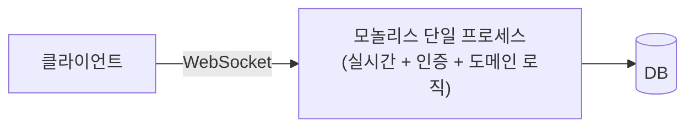
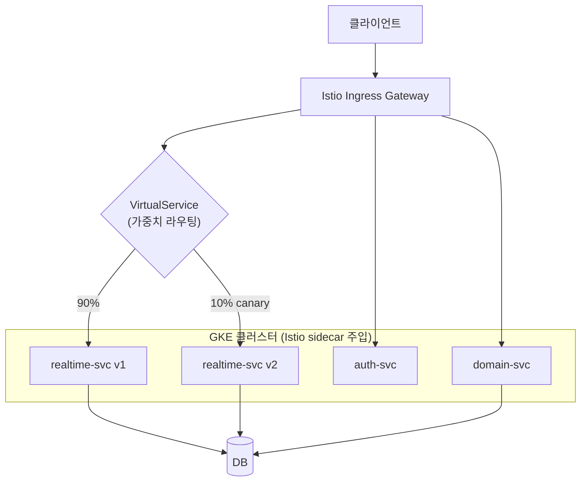

<!-- Sanitized — 고객사명·시크릿·내부 식별자 제거. 일반화한 부분은 "(일반화함)"으로 표기. 미확정 수치는 TODO. -->

# 모놀리식 → 마이크로서비스(GKE) + Istio 점진적 배포 — 실시간 WebSocket 서비스를 무중단으로 분해

> **TL;DR**: 단일 프로세스에 실시간 통신·비즈니스 로직이 뭉쳐 있어 배포 한 번에 전체가 재시작되던 WebSocket 모놀리스를, 역할별 서비스로 분해해 **GKE**로 이관하고 **Istio**(VirtualService/DestinationRule)로 카나리·트래픽 분할·retry/timeout/circuit breaking을 적용해 **무중단 점진적 배포** 체계를 만들었습니다.

| | |
|---|---|
| **역할 (Role)** | 아키텍처 분해 설계 + GKE 이관 + Istio 트래픽 정책 구축 담당 |
| **기간·규모 (Scope)** | TODO: <운영 기간 / 서비스 분해 개수 / 동시 WebSocket 연결 수 / RPS> |
| **스택 (Stack)** | GKE(Kubernetes), Istio(Envoy), WebSocket, Docker, Helm/Kustomize, GitLab CI/CD, Prometheus |
| **핵심 결과 (Impact)** | 전체 재시작 배포 → 서비스 단위 카나리 무중단 배포. 장애 blast radius를 서비스 단위로 축소, 서비스별 독립 스케일링 확보 |

---

## 1. 문제 또는 맞이했던 상태

실시간 기능을 WebSocket으로 제공하는 서비스가 **단일 모놀리스 프로세스**로 운영되고 있었음. 실시간 연결·분석 처리들이 한 프로세스에 결합돼 있어 다음 문제들이 발생했음. ( 단 도메인 비지니스 로직은 cloud run(serverless) 으로 rest api 쪽을 FinOps로 처리했음 )

- **배포 = 전체 재시작** → 배포할 때마다 WebSocket 연결이 끊김. nodejs 의 WebSocket 서버로 python backend 분석 서비스를 이용 중인 사용자에겐 서비스 끊김 발생 .
- **OOM 이 발생한 상황이 단일 머신 장애로 발생** → 그래프 분석 시 호스트의 메모리를 크게 점유해야했으므로 단일 머신에서 OOM 은 다른 분석 서비스의 실행을 방해했음
- **스케일링이 전체 단위** → 부하 특성을 다르게 줘야했음. 리소스 사용량이 많은 머신에 WebSocket 연결 수용을 낮추고 널럴한 머신으로 연결을 돌려야 함.
- **점진적 배포 불가** → 새 버전을 일부 트래픽에만 흘려 검증하는 수단이 없음 , 사용자에게 서비스 불가 공지 했음.

## 2. 제약조건

- **무중단 필수** — 실시간 WebSocket 연결 특성상 전체 재시작을 피해야 함.
- **점진적 전환** — 기존 모놀리스를 운영하면서 기능을 하나씩 떼어내야 함(서비스 중단 불가).
- **트래픽 제어를 코드가 아닌 인프라 레이어에서** — 카나리·재시도·서킷브레이킹을 애플리케이션마다 구현하기는 난이도 높았음.
- **운영 인력 제약** — 컨트롤플레인을 직접 운영하기보다 managed(GKE)로 부담을 낮춤. ([#01](01-gpu-platform-multitenancy.md)에서 "현 규모엔 풀 k8s 과부하"의 연장선 — 워크로드가 커지는 이 시점에 managed k8s로 전환.)

## 3. 검토한 대안 + 선택 근거

### (a) 컴퓨트/오케스트레이션(MIG vs GKE)

| 대안 | 장점 | 단점 | 채택 |
|---|---|---|---|
| MIG + HTTP Load Balancer | 단순 구조, 익숙 | 카나리 업데이트와 수평확장에 다른 managed service Pub/Sub 필요에 따른 복잡성 증대 | 안함 |
| GKE(HPA,NAP) + Gateway | 운영 중 단계적 이관, 롤백 용이 , 수평 확장 , 2억 credit 으로 넉넉한 managed service 의 다양한 적용 실험도 가능했음 | GCP ACE 자격증 취득 후 곧바로 GKE 적용 난이도 | ✅ |

### (b) 트래픽/배포 제어

| 대안 | 장점 | 단점 | 채택 |
|---|---|---|---|
| 자체 게이트웨이/LB 분기 로직 | 의존성 없음 | 카나리·retry·circuit breaking을 직접 구현·유지 | 안함 |
| Istio service mesh | 트래픽 분할·retry/timeout·circuit breaking을 **선언적**·앱(WebSocket nodejs 소스코드) 무수정 | 메시 학습·운영 비용 | ✅ |

→ **Istio + GKE**: 모놀리스를 운영하면서 역할별로 서비스를 떼어내고, Istio로 신·구 버전에 트래픽을 가중치로 흘려 카나리 검증 후 점진 전환했음.

## 4. 아키텍처 (Architecture)

**Before — WebSocket 모놀리스**



**After — GKE + Istio service mesh**



## 5. 구현 핵심 (Implementation Highlights)

> 실제 매니페스트를 일반화한 대표 예시입니다.

**(1) 카나리 트래픽 분할 — VirtualService (일반화함)**

```yaml
apiVersion: networking.istio.io/v1beta1
kind: VirtualService
metadata:
  name: realtime-svc
spec:
  hosts: [realtime-svc]
  http:
    - route:
        - destination: { host: realtime-svc, subset: v1 }
          weight: 90
        - destination: { host: realtime-svc, subset: v2 }   # 카나리: 10%만 신버전으로
          weight: 10
      timeout: 0s # networkx , cuGraph 분석은 기본적으로 matrix dimension 이 클 경우 5분이상~2시간 미만의 큰 시간 소모 변동성을 보임 , 모델의 추론 서비스도 10분이상을 소요하므로 0s
      retries:
        attempts: 3
        perTryTimeout: 5s
        retryOn: connect-failure,refused-stream,5xx
```

**(2) 서브셋 정의 + 서킷브레이킹 — DestinationRule (일반화함)**

```yaml
apiVersion: networking.istio.io/v1beta1
kind: DestinationRule
metadata:
  name: realtime-svc
spec:
  host: realtime-svc
  trafficPolicy:
    connectionPool:
      tcp: { maxConnections: 1000 }
      http: { http1MaxPendingRequests: 100, maxRequestsPerConnection: 0 }  # WS는 연결 재사용
    outlierDetection:        # 비정상 인스턴스 자동 격리(서킷브레이킹)
      consecutive5xxErrors: 5
      interval: 10s
      baseEjectionTime: 30s
    loadBalancer:
      consistentHash:        # WebSocket 세션 고정(연결 유지)
        httpHeaderName: x-session-id
  subsets:
    - { name: v1, labels: { version: v1 } }
    - { name: v2, labels: { version: v2 } }
```

**(3) 무중단 배포 흐름 (일반화함)**

```
v2 배포 → VirtualService weight v2=10% → 메트릭/에러율 관측(Prometheus)
  └ 정상: 10 → 30 → 50 → 100 단계 상향
  └ 이상: weight v2=0 즉시 롤백 (앱 재배포 없이 라우팅만 전환)
```

## 6. 결과 (Results)

**정성적 임팩트**: 배포가 on-prem 의 단일 머신에서 이뤄지던 점검 중 서비스 불가에서 GKE 클러스터 상의 카나리 업데이트를 통해 점진적 반영으로 개선 됐음. 장애 영향 범위가 서비스 단위로 좁혀짐. 부하 특성이 다른 실시간 로직을 독립적으로 스케일링할 수 있게 됨.

## 7. 회고 / 다음 단계 (Retrospective)

- **잘된 점**: 트래픽 제어를 앱이 아닌 메시 레이어로 분리해, 카나리·재시도·서킷브레이킹을 앱 수정 없이 선언적으로 운영. 무중단 점진 전환 달성.
- **한계 / 트레이드오프**: Istio(Envoy sidecar)로 인한 운영 복잡도·리소스 오버헤드 증가. WebSocket 세션 고정/업그레이드 처리에 메시 설정 주의가 필요.
- **다음에 한다면**: 카나리 비율 상향을 메트릭 기반으로 자동화(progressive delivery — 예: Argo Rollouts/Flagger)해 사람 개입 없이 SLO 위반 시 자동 롤백.
