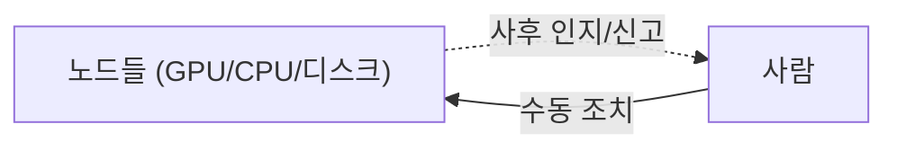
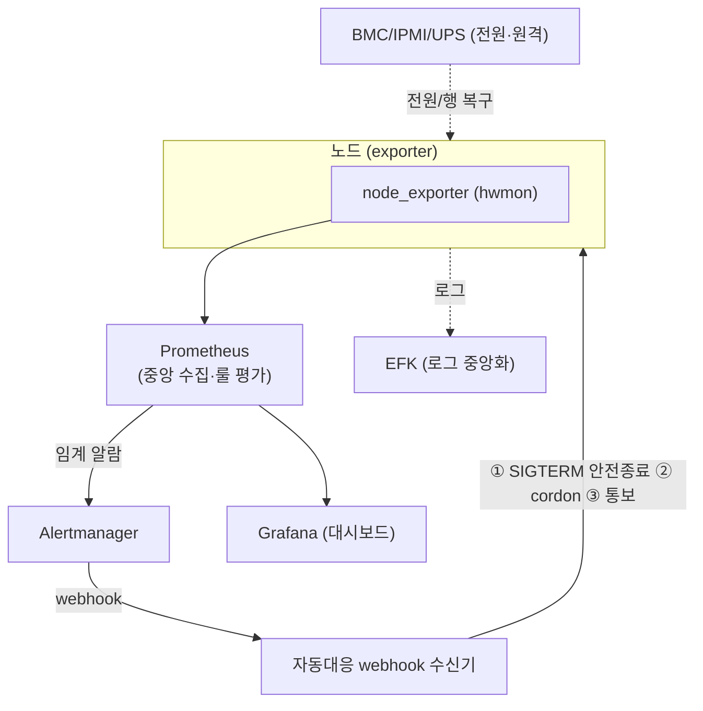

<!-- Sanitized — 고객사명·시크릿·내부 식별자 제거. 일반화한 부분은 "(일반화함)"으로 표기. 미확정 수치는 TODO. -->

# 관측·자동대응 체계 구축 (SRE) — 온도 이상에 학습 잡을 graceful shutdown하는 무인 대응

> **TL;DR**: 장애를 사람이 사후에 발견하던 온프레미스 GPU 환경에, Prometheus로 메트릭을 중앙 수집하고 Alertmanager webhook으로 **온도 임계 초과 시 학습 잡을 graceful shutdown**하는 자동대응을 붙였습니다. EFK 로그 중앙화와 BMC/IPMI/UPS 원격관리로 하드웨어 레벨까지 관측·대응 범위를 넓혔습니다.

| | |
|---|---|
| **역할 (Role)** | 관측 스택 설계·구축 + 자동대응(webhook) 구현 + 하드웨어 원격관리 담당 |
| **기간·규모 (Scope)** | 노드 수 **4** / 수집 메트릭 **4(CPU · MEMORY · DISK · THERMAL)** / 알람 룰 수 **4** |
| **스택 (Stack)** | Prometheus, Alertmanager, node_exporter(hwmon), Grafana, EFK(Elasticsearch/Fluentd/Kibana), BMC/IPMI, UPS |
| **핵심 결과 (Impact)** | "사람이 사후 발견"하던 장애 대응을, 임계 초과 시 자동으로 잡을 안전 종료하고 노드를 격리하는 **무인 1차 대응**으로 전환. on-prem 하드웨어 보호 |

---

## 1. 문제 또는 맞이했던 상태

[#01 GPU 플랫폼](01-gpu-platform-multitenancy.md)을 멀티테넌트로 운영하게 되면서, 자원·하드웨어 상태를 **관측할 수단이 없다는 것**이 다음 병목으로 드러났습니다.

- **장애를 사후에 사람이 발견** → CPU/GPU 온도 상승 88~95도씨, OOM, 디스크 포화 등을 누군가 직접 보거나 사용자 신고로 인지.
- **온도 이상이 곧 하드웨어 리스크** → 장시간 대형 학습으로 CPU/GPU 온도가 임계까지 올라가도 자동 차단 수단이 없어, 사람이 못 보면 하드웨어 손상/스로틀링으로 이어짐.
- **로그가 노드별로 흩어짐** → 장애 원인 추적 시 노드마다 접속해 grep, timeline 상관관계 파악이 어려움.
- **전원·하드웨어 레벨 사각지대** → 정전 상황에서 원격으로 상태를 보거나 복구할 수단이 부족.

## 2. 제약조건

- **온프레미스** — 클라우드 관리형 모니터링을 쓸 수 없어 관측 스택을 직접 구축·운영해야 함.
- **무인 1차 대응 필요** — 1인 운영에 가까워, 야간·부재 시에도 위험 상황(온도)을 사람 개입 없이 막아야 함.
- **학습 잡 손실 최소화** — 위험 대응이라도 진행 중인 장시간 학습을 강제 kill하면 손실이 큼 → "안전 종료"가 전제.
- **하드웨어 레벨까지** — OS가 응답 없는 상황에도 원격 진단/전원 제어가 가능해야 함(BMC/IPMI/UPS).

## 3. 검토한 대안 + 선택 근거

### (a) 메트릭 수집/관측

| 대안 | 장점 | 단점 | 채택 |
|---|---|---|---|
| 전통 모니터링(Zabbix) | 익숙, 즉시 알람 | GPU/컨테이너 메트릭 확장·timeline 분석 약함 | 안함 |
| Prometheus + exporter | pull·exporter 생태계(node_exporter hwmon), timeline·alert rule 표준, docker swarm cluster 형태로 join 쉬움 | 직접 구성·스토리지 운영 | ✅ |

### (b) 이상 상황 대응 방식

| 대안 | 장점 | 단점 | 채택 |
|---|---|---|---|
| 사람이 알람 받고 수동 조치 | 단순 | 야간·부재 시 무방비, 대응 지연 | 안함 |
| 즉시 강제 종료(kill) | 확실히 부하 제거 | 진행 중 학습 통째 손실 | 안함 |
| Alertmanager webhook → graceful shutdown | 무인 자동 대응 + 체크포인트 후 안전 종료 | webhook 수신/대응 로직 직접 구현 | ✅ |

### (c) 로그

| 대안 | 장점 | 단점 | 채택 |
|---|---|---|---|
| 노드별 로컬 로그 | 추가 구성 없음 | 분산·상관분석 불가 | 안함 |
| EFK 중앙화 | 중앙 검색·시각화·알람 연계 | 스택 운영 공수 발생 | ✅ |

→ **Prometheus(node_exporter hwmon) 관측 + Alertmanager webhook 자동대응 + EFK 로그 중앙화 + BMC/IPMI/UPS 하드웨어 원격관리**의 4층 체계.

## 4. 아키텍처 (Architecture)

**Before — 사후 수동 대응**



**After — 관측 → 자동대응**



## 5. 구현 핵심 (Implementation Highlights)

> 실제 구성을 일반화한 대표 예시입니다.

**(1) 온도 알람 룰 — Prometheus (일반화함)**

```yaml
groups:
  - name: node-thermal
    rules:
      - alert: NodeTemperatureCritical
        # node_exporter hwmon 메트릭(CPU 등 온보드 센서), 임계는 환경별 조정
        expr: node_hwmon_temp_celsius > 90
        for: 1m                              # 순간 스파이크 무시, 지속 시에만 발화
        labels: { severity: critical }
        annotations:
          summary: "{{ $labels.instance }} / {{ $labels.sensor }} 온도 임계 초과"
```

**(2) 임계 알람을 자동대응 webhook으로 라우팅 — Alertmanager (일반화함)**

```yaml
route:
  receiver: default
  routes:
    - matchers: ['alertname="NodeTemperatureCritical"']
      receiver: thermal-autoremediation
receivers:
  - name: thermal-autoremediation
    webhook_configs:
      - url: http://autoremediation:9000/thermal
        send_resolved: true                  # 해소 시점도 받아 cordon 해제 판단
```

**(3) 자동대응 — 강제 kill이 아닌 graceful shutdown (일반화함)**

```python
# 온도 임계 알람 수신 → 해당 노드를 "안전하게" 비움
@app.post("/thermal")
def on_thermal(alert):
    node = alert["labels"]["instance"]
    drain_jobs(node, signal="SIGTERM", grace=120)  # ① 체크포인트 저장 유도 후 종료
    cordon(node)                                   # ② 신규 스케줄 차단(추가 발열 방지)
    notify_oncall(node, reason="thermal")          # ③ 사람에게 통보
```

- **강제 kill이 아닌 SIGTERM**이라, 진행 중 학습이 상시 가동되는 NAS에 체크포인트를 저장한 뒤 종료됨 → 학습 손실이 없어 기업부설연구소 연구 인원들의 만족도가 높았음.
- 통보는 Grafana의 thermal alert와 **Slack을 동시 운영**해, 자동대응이 발생한 사실을 사람도 즉시 인지하도록 함.

**(4) 자동대응 — 강제 kill된 machine 을 다시 boot up 하기위해 사내망에서 동작하는 gitlab runner schedule**
```yaml
health-check-and-wake:
  stage: monitor
  rules:
    - if: '$CI_PIPELINE_SOURCE == "schedule"'
  script:
    - |
      BMC_IP="<bmc-ip>"
      HOST_IP="<host-ip>"
      #TARGET_MAC="<host-mac>"
      if ping -c 3 -W 2 "$HOST_IP" > /dev/null; then
        echo "Host alive"
      else
        echo "Host down -> ipmi chassis power on"

        # wakeonlan 지원 마더보드가 벤더사마다 달라서 wakeonlan cli 는 안씀
        ipmitool -I lanplus -H "$BMC_IP" -U "$IPMI_USER" -P "$IPMI_PASS" chassis power on
      fi
```

**(5) 로그 중앙화 — Fluentd → Elasticsearch (일반화함)**

```
<match **>
  @type elasticsearch
  host es-logging
  logstash_format true        # Kibana에서 timeline·노드 상관분석
</match>
```

**(6) UPS — ups connect 기능 활용해서 건물 전원 차단 시 대응**

- **UPS 를 worker machine이 아닌 Synology NAS에 연결** → 전원 차단 시 UPS 가 정전을 감지하고 보조전력을 공급하려는 신호를 NAS 에 전달. Synology NAS 의 기능 중 UPS 전원 차단 신호를 등록된 list 의 worker machine 들에 공유하는 기능 활용. 


## 6. 결과 (Results)

**정성적 임팩트**: 온도가 임계치를 상회하는 위험한 시점에 "사람이 제때 못 보면 하드웨어 손상"으로 이어지던 위험을, 사람 개입 없이 **체크포인트 후 안전 종료 → 노드 격리 → 통보**로 1차 차단하는 체계로 전환. 장애 원인 추적도 노드별 grep에서 중앙 검색(EFK)으로 바뀌어 대응 시간이 단축됨. BMC/IPMI/UPS로 OS 무응답·정전 상황까지 원격 진단·복구 범위를 넓힘.

## 7. 회고 / 다음 단계 (Retrospective)

- **잘된 점**: 관측을 알람에서 멈추지 않고 **자동대응까지** 이은 것 — 특히 강제 kill이 아닌 graceful shutdown으로 "위험 차단"과 "학습 손실 방지"를 동시에 달성. 하드웨어(BMC/IPMI/UPS) 레벨까지 사각지대를 줄임.
- **한계 / 트레이드오프**: 소프트웨어 자동대응은 어디까지나 임시 차단이라, 서버실 쿨링 자체에 대한 대비가 별도로 필요함. 다만 항온항습 장치는 비용이 크고 IDC 대여 시에도 비용 부담이 커서, 온프레미스 환경에서 근본 해결엔 한계가 있었음.
- **다음에 한다면**: 대응 액션을 코드형 runbook(자동 실행 + 사람 승인 게이트)으로 확장하고, 인프라를 클라우드에서 처음부터 구성해 전원·냉각 같은 물리 리스크 자체를 위임.
