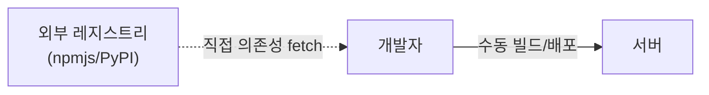
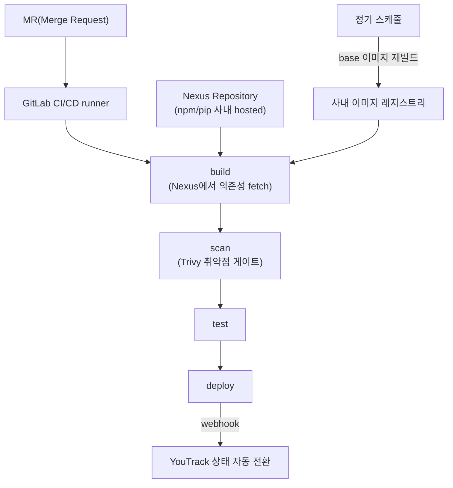

<!-- Sanitized — 고객사명·시크릿·내부 식별자 제거. 일반화한 부분은 "(일반화함)"으로 표기. 미확정 수치는 TODO. -->

# 안전한 CI/CD 배포 플랫폼 (DevSecOps) — 셀프서비스 파이프라인에 공급망 보안을 내장

> **TL;DR**: 수작업·비표준 배포를 GitLab CI/CD로 표준화하면서, 이미지 취약점 스캔과 base 이미지 정기 재빌드, Nexus를 통한 의존성(npm/pip) 통일로 **공급망 보안을 파이프라인에 적용**했습니다. MR 단위 격리 파이프라인과 GitLab→YouTrack 자동 상태 전환으로 배포를 셀프서비스화하고 이슈-배포를 추적 가능하게 만들었습니다.

| | |
|---|---|
| **역할 (Role)** | CI/CD 파이프라인 설계·구축 + 공급망 보안 정책 + 이슈/배포 연계 자동화 담당 |
| **스택 (Stack)** | GitLab CI/CD(runner), Docker, Trivy(이미지 스캔), Nexus Repository(npm/pip proxy), YouTrack, Prometheus |
| **핵심 결과 (Impact)** | 수작업 배포 → 셀프 파이프라인. 취약점 스캔·base 재빌드·의존성 통일. 리스크를 빌드 단계에서 차단. 이슈-배포 상태를 자동 동기화 |

---

## 1. 문제 또는 맞이했던 상태

배포가 표준화되지 않아, 빌드·배포가 사람 손과 환경에 의존하고 보안 관점의 게이트가 전혀 없었습니다.

- **비표준 수작업 배포** → 누가·어떤 환경에서 빌드했는지에 따라 결과가 달라지고(재현성↓), 배포 절차가 사람에 묶임.
- **공급망 무방비** → 의존성을 외부 레지스트리(npmjs/PyPI)에서 직접 받아 빌드 → 외부 장애·변조·삭제(예: 패키지 yank)에 그대로 노출.
- **이미지 보안 게이트 부재** → 베이스/런타임 이미지의 알려진 취약점(CVE)을 확인하지 않고 배포.
- **이슈와 배포가 단절** → 코드가 머지·배포돼도 이슈 트래커(YouTrack) 상태는 사람이 수동으로 바꿔야 해 추적이 끊김.

## 2. 제약조건

- **사내(온프레미스) GitLab 중심** — 배포 파이프라인을 직접 운영하며 외부 의존을 최소화해야 함.
- **공급망 차단이 전제** — 외부 레지스트리 직접 접근을 줄이고, 재현 가능·검증 가능한 의존성 경로가 필요.
- **셀프서비스** — 1인 운영에 가까워, 개발자가 직접 MR 단위로 빌드·검증·배포할 수 있어야 운영 공수가 줄어듦.
- **기존 워크플로 존중** — 이미 쓰던 이슈 트래커(YouTrack)와 끊기지 않게 연계.

## 3. 검토한 대안 + 선택 근거

### (a) 의존성 관리

| 대안 | 장점 | 단점 | 채택 |
|---|---|---|---|
| 외부 레지스트리 직접(npmjs/PyPI) | 추가 인프라 없음 | 외부 장애·변조·삭제에 노출, 재현성↓ | 안함 |
| Nexus 사내 hosted 일원화 | 빌드가 사내 저장소에서만 의존성 수급 → 외부 직접 접근 차단, 단일 출처로 재현성·검증 지점 확보 | 저장소 운영·반입 관리 필요 | ✅ |

### (b) 이미지 보안

| 대안 | 장점 | 단점 | 채택 |
|---|---|---|---|
| 스캔 없이 배포 | 빠름 | 알려진 CVE 그대로 배포 | 안함 |
| 파이프라인 내 취약점 스캔 + base 정기 재빌드 | 빌드 단계에서 차단, 패치 지속 반영 | 스캔 시간·정책 관리 | ✅ |

### (c) 이슈/배포 연계

| 대안 | 장점 | 단점 | 채택 |
|---|---|---|---|
| 수동 상태 전환 | 단순 | 누락·지연, 추적 단절 | 안함 |
| GitLab → YouTrack 자동 연계 | 머지/배포와 이슈 상태 동기화 | 연동 구현·유지 | ✅ |

→ **Nexus 의존성 일원화 + 이미지 취약점 스캔/base 재빌드 + MR 단위 셀프서비스 파이프라인 + YouTrack 자동 연계**.

## 4. 아키텍처 (Architecture)

**Before — 수작업·비표준 배포**



**After — 셀프서비스 + 공급망 보안 파이프라인**



## 5. 구현 핵심 (Implementation Highlights)

> 실제 구성을 일반화한 대표 예시입니다.

**(1) 파이프라인 단계 + MR 단위 격리 (일반화함)**

```yaml
stages: [build, scan, test, deploy]

# MR마다 격리된 검증 파이프라인 — 개발자 셀프서비스 + 머지 전 디버깅
review:
  rules:
    - if: '$CI_PIPELINE_SOURCE == "merge_request_event"'
  script:
    - make build test
```

**(2) 이미지 취약점 스캔 게이트 — Trivy (일반화함)**

```yaml
container_scan:
  stage: scan
  script:
    # HIGH/CRITICAL 취약점 발견 시 exit 1 → 파이프라인 실패로 배포 차단
    - trivy image --severity HIGH,CRITICAL --exit-code 1 "$IMAGE"
```

**(3) base 이미지 정기 재빌드 — 패치 지속 반영 (일반화함)**

```yaml
rebuild-base:
  stage: build
  rules:
    - if: '$CI_PIPELINE_SOURCE == "schedule"'   # 정기 스케줄로 OS/패키지 보안패치 반영
  script:
    - docker build --no-cache -t "$REGISTRY/base:latest" base/
    - docker push "$REGISTRY/base:latest"
```

**(4) 의존성 일원화 — Nexus 사내 hosted (일반화함)**

```ini
# .npmrc — npm을 사내 Nexus(hosted) 저장소로 (외부 직접 접근 차단 + 단일 출처)
registry=https://<nexus-host>/repository/npm-hosted/

# pip.conf — pip도 동일하게
# [global]
# index-url = https://<nexus-host>/repository/pypi-hosted/simple
```

**(5) GitLab → YouTrack 상태 자동 전환 (일반화함)**

```
# MR merge / deploy 성공 webhook → YouTrack REST API로 이슈 State 전환
# 커밋·MR 메시지의 이슈 키(예: PRJ-123)를 파싱해 대상 이슈를 찾고 자동 갱신
POST /api/issues/PRJ-123  { "state": "Fixed" }
```

## 6. 결과 (Results)

**정성적 임팩트**: 배포가 "사람·환경에 묶인 수작업"에서 "MR을 올리면 빌드·스캔·테스트·배포가 돌아가는 셀프서비스 파이프라인"으로 바뀜. 의존성을 Nexus로 일원화해 외부 레지스트리 장애·변조에 대한 노출을 줄이고 빌드 재현성을 확보했으며, 취약점 스캔과 base 재빌드로 알려진 CVE를 빌드 단계에서 차단. 이슈-배포 상태가 자동 동기화되어 추적이 끊기지 않게 됨.

## 7. 회고 / 다음 단계 (Retrospective)

- **잘된 점**: 보안을 별도 단계가 아니라 **파이프라인 게이트로 내장**(shift-left)한 것 — 스캔 실패 시 배포가 막히므로 "검사했지만 안 막는" 형식적 보안을 피함. Nexus 일원화로 공급망 노출 지점을 좁힘.
- **한계 / 트레이드오프**: 스캔을 HIGH/CRITICAL로 막으면 오탐·미수정 CVE로 파이프라인이 자주 깨질 수 있어, 예외(허용목록)·SLA 관리가 필요. base 재빌드 주기와 패치 반영 사이엔 항상 시차 존재.
- **다음에 한다면**: 스캔 통과한 base 레이어를 재사용해 빌드마다 전체 재스캔을 피해서 파이프라인 시간을 단축
