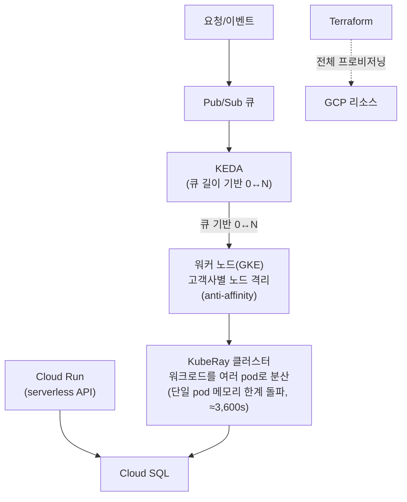

<!-- Sanitized — 고객사명·시크릿·내부 식별자 제거. 일반화한 부분은 "(일반화함)"으로 표기. 미확정 수치는 TODO. -->

# 클라우드 마이그레이션 & 비용 최적화

> **TL;DR**: 온프레미스 2대로 3개 고객사의 그래프 분석을 돌리다 보니, 한 고객사 작업의 OOM이 같은 노드의 다른 고객사 서비스까지 동반 kill하고 처리 규모도 단일 머신 메모리에 묶여 있었습니다(45,000 dim 한계). 클라우드로 이관하면서 **KubeRay로 워크로드를 여러 pod에 분산해 단일 pod 메모리 한계를 돌파(처리 규모 80,000 dim, OOM 제거)**하고, **KEDA로 고객사 워크로드를 노드 단위로 격리 + 유휴 시 scale-to-zero**했습니다. 결과적으로 대형 처리시간 약 60,000s→3,600s(≈16배), 동시 고객사 3→10, 월 비용 700→350만(≈절반)을 달성하고 전체를 Terraform으로 코드화했습니다.

| | |
|---|---|
| **역할 (Role)** | 클라우드 이관 설계 + 워크로드 분산(Ray) + 이벤트 기반 오토스케일링·비용 최적화 + IaC 담당 |
| **기간·규모 (Scope)** | 이관 서비스 수 : 7개 (react,nest,mysql,mongo,elasticsearch,redis,ci/cd) / 워크로드 데이터 규모 : on-prem (45000 dimension 한계의 graph data) -> cloud (80000 dimension) , 고객사 : 3개 -> 10개 / serverless 적용 후 월 비용 변화 : 700만원 -> 350만원 |
| **스택 (Stack)** | GCP(Cloud Run, Cloud SQL, Pub/Sub), Ray(KubeRay), KEDA, Kubernetes(GKE), Terraform |
| **핵심 결과 (Impact)** | 처리 규모 **45k→80k dim(OOM 제거)** · 처리시간 **≈16배(60,000s→3,600s)** · 동시 고객사 **3→10** · 월 비용 **700→350만(≈50%↓)**. KEDA 노드 격리 + scale-to-zero, KubeRay pod 분산, 전체 Terraform 코드화 |

---

## 1. 문제 또는 맞이했던 상태

[#01 GPU 플랫폼](01-gpu-platform-multitenancy.md)에서 "규모가 커지면 동적 분산이 다음 단계"로 남겨뒀던 워크로드가, 실제로 온프레미스 단일 처리의 한계에 부딪혔습니다.

- **단일 처리로 약 60,000초(≈16.7시간)** → 대형 작업을 한 머신에서 순차 처리해 반복 주기가 지나치게 김.
- **고정비·확장 불가** → 간헐적으로만 큰 작업이 몰리는데, 그에 맞춰 온프레미스 자원을 상시 보유 → 평소엔 유휴, 피크엔 부족.
- **상시 가동 비용** → 트래픽이 없을 때도 서비스/워커가 계속 떠 있어 비용이 사용량과 무관하게 발생.
- **멀티테넌트 OOM 장애** → 온프레미스 2대로 3개 고객사 분석을 돌리다 보니 사용자에게 분석 사이즈 제한을 걸어야 했고, 한 고객사 작업의 OOM이 같은 노드의 다른 고객사 서비스까지 동반 kill하는 장애로 번짐.
- **단일 머신 처리 규모 한계** → 그래프 데이터 차원이 약 45,000을 넘으면 단일 머신 메모리로는 OOM 없이 처리 불가.
- **수작업 인프라** → 환경 구성이 콘솔/수작업이라 재현·이관·변경 추적이 어려움.

## 2. 제약조건

- **간헐적·버스트성 부하** — 평소엔 거의 없고 특정 시점에 크게 몰리는 패턴 → "쓴 만큼" 과금되는 탄력성이 핵심.
- **비용 최적화가 1차 목표** — 클라우드로의 이관과 동시에 비용 구조 개선.
- **운영 인력 제약** — 관리형 서비스(serverless/managed)로 운영 부담을 낮춰야 함.
- **재현 가능성** — 환경을 코드로 정의해 이관·복구·변경을 추적 가능하게.

## 3. 검토한 대안 + 선택 근거

### (a) 대형 워크로드 처리

| 대안 | 장점 | 단점 | 채택 |
|---|---|---|---|
| 단일 노드 순차 처리 | 단순 | ≈16.7시간, 단일 머신 메모리에 처리 규모가 묶임(45k dim 초과 시 OOM) | 안함 |
| Ray(KubeRay) 분산 | 단일 pod VPA/메모리 한계를 넘어 워크로드를 여러 pod로 분산 → OOM 없이 더 큰 워크로드(45k→80k dim), 처리시간도 단축 | 클러스터 구성·관리 | ✅ |

### (b) 서비스 실행 형태

| 대안 | 장점 | 단점 | 채택 |
|---|---|---|---|
| 상시 VM/인스턴스 | 단순·예측 가능 | 유휴에도 과금, 탄력성↓ | 안함 |
| Cloud Run(serverless) | scale-to-zero, 사용량 과금, 운영 위임 | 콜드스타트·장기 실행 제약 | ✅ |

### (c) 이벤트 기반 스케일링

| 대안 | 장점 | 단점 | 채택 |
|---|---|---|---|
| 고정 워커 수 | 단순 | 큐 적체 시 지연 / 평시 유휴 비용 | 안함 |
| KEDA + Pub/Sub(큐 길이 기반) | 큐 적체에 따라 0↔N 자동 확장, 유휴 0; 노드 단위 스케줄링과 결합해 고객사 워크로드를 분리(cross-tenant OOM 방지) | KEDA·메트릭 구성 | ✅ |

### (d) 인프라 관리

| 대안 | 장점 | 단점 | 채택 |
|---|---|---|---|
| 콘솔/수작업 | 진입 쉬움 | 재현·추적 불가 | 안함 |
| Terraform(IaC) | 재현·리뷰·변경추적 | 학습·상태관리 | ✅ |

→ **KubeRay pod 분산(메모리 한계 돌파·처리시간) + KEDA·Pub/Sub(테넌트 격리·탄력성·비용) + Cloud Run(serverless) + Terraform(재현성)**의 조합.

## 4. 아키텍처 (Architecture)

**Before — 온프레미스 단일 처리**


**After — 클라우드 분산 + 이벤트 기반 스케일링**



## 5. 구현 핵심 (Implementation Highlights)

> 실제 구성을 일반화한 대표 예시입니다.

**(1) KubeRay 분산 — 단일 pod 메모리 한계를 여러 pod로 돌파 (일반화함)**

```python
import ray
ray.init(address="auto")                # KubeRay 클러스터에 연결

@ray.remote(num_cpus=2, memory=4 * 1024**3)   # pod 단위 자원 — 작업을 여러 pod에 분산
def process(shard):
    return heavy_compute(shard)

# 단일 pod 메모리에 묶이던 작업을 샤드로 쪼개 여러 pod에 분산
# → OOM 없이 더 큰 입력(45k→80k dim) 처리 + 처리시간 ≈60,000s→3,600s
futures = [process.remote(s) for s in shards]
results = ray.get(futures)
```

**(2) KEDA — Pub/Sub 큐 길이 기반 scale-to-zero (일반화함)**

```yaml
apiVersion: keda.sh/v1alpha1
kind: ScaledObject
metadata:
  name: batch-worker
spec:
  scaleTargetRef:
    name: batch-worker
  minReplicaCount: 0          # 큐가 비면 0으로 → 유휴 비용 제거
  maxReplicaCount: 50
  triggers:
    - type: gcp-pubsub
      metadata:
        subscriptionName: jobs-sub
        mode: SubscriptionSize
        value: "10"           # 미처리 메시지 10개당 워커 1개
```

- KEDA가 큐 기반으로 워커를 0↔N으로 조절하고, 워커 Pod에 **노드 안티어피니티/테넌트 분리 스케줄링**을 걸어 고객사 워크로드가 한 노드에 겹치지 않게 함 → 한 고객사의 OOM이 다른 고객사로 번지지 않음.

**(3) Cloud Run — serverless scale-to-zero (Terraform, 일반화함)**

```hcl
resource "google_cloud_run_v2_service" "api" {
  name     = "api"
  location = var.region
  template {
    scaling { min_instance_count = 0 }   # 트래픽 없으면 0 인스턴스(과금 0)
    containers { image = var.image }
  }
}
```

## 6. 결과 (Results)

| 지표 | Before | After | 개선 |
|---|---|---|---|
| 처리 가능 규모(그래프 차원) | 45,000 dim (초과 시 OOM) | 80,000 dim | **≈1.8배, OOM 제거** |
| 대형 워크로드 처리시간 | ≈60,000s (≈16.7h) | ≈3,600s (≈1h) | **약 16배 단축** |
| 동시 수용 고객사 | 3 | 10 | **3.3배** |
| 월 비용 | 700만 원 | 350만 원 | **≈50%↓** |
| 워커 유휴 비용 | 상시 가동 | 큐 0 → 워커 0 | scale-to-zero |
| 고객사 간 장애 격리 | OOM이 타 고객사까지 동반 kill | 노드 단위 격리 | cross-tenant kill 제거 |
| 인프라 변경 | 수작업·비추적 | Terraform 코드 | 재현·리뷰 가능 |

**정성적 임팩트**: "개발"이 아니라 **워크로드를 플랫폼으로 분산·격리·확장한** 사례 — 단일 pod 메모리 천장에 묶이던 그래프 분석을 KubeRay로 여러 pod에 분산해 OOM 없이 처리 규모를 45k→80k dim으로 키웠고, KEDA 노드 격리로 한 고객사의 OOM이 다른 고객사를 죽이던 장애를 제거했습니다. 동시에 scale-to-zero·serverless로 월 비용을 절반(700→350만)으로 줄이고 수용 고객사를 3→10으로 늘렸으며, 인프라는 Terraform으로 코드화했습니다.

## 7. 회고 / 다음 단계 (Retrospective)

- **잘된 점**: 이관을 단순 lift-and-shift가 아니라 **격리·확장성·비용 재설계**의 기회로 삼은 것 — KubeRay pod 분산으로 단일 pod 메모리 한계를 돌파(처리 규모↑·OOM 제거)하고, KEDA 노드 격리로 cross-tenant 장애를 끊고, scale-to-zero로 유휴 비용까지 동시에 공략. [#01](01-gpu-platform-multitenancy.md)에서 "다음 단계"로 미뤘던 동적 분산을 실제로 구현.
- **한계 / 트레이드오프**: scale-to-zero는 콜드스타트 지연을 동반 → 지연 민감 경로엔 min 인스턴스 유지가 필요. Ray 분산 효율은 샤드 분할·데이터 지역성에 좌우되어 선형 확장은 아님.
- **다음에 한다면**: 비용/성능을 지속 관측(FinOps 대시보드)하고, 분산 작업에 spot/preemptible 인스턴스를 도입해 비용을 추가 절감하는 방향.
